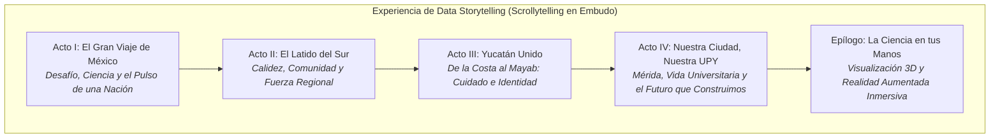
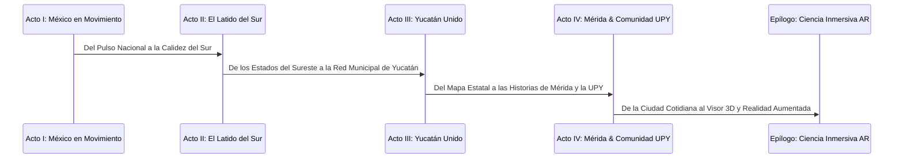

# Data Storytelling: El Viaje de la Resiliencia, la Ciencia y la Comunidad (México -> Sur -> Yucatán -> Mérida & UPY)

## Resumen de la Experiencia y Narrativa Visual (Scrollytelling Funnel)

Este libro rector establece la narrativa de **Data Storytelling visual, entretenida, amigable y centrada en el ser humano** para el *Análisis de la Pandemia de COVID-19 y la Reconstrucción Socio-Sanitaria y Territorial*. 

A diferencia de los boletines gubernamentales fríos y formales, este proyecto transforma los datos en una **historia apasionante de resiliencia, ciencia, solidaridad y adaptación comunitaria**. Guiamos al lector a través de una experiencia interactiva tipo *Scrollytelling en Embudo (Macro a Micro)* organizada en 4 Actos Principales y un Epílogo Inmersivo:

> [!NOTE]
> **Principio de Separación de Arquitectura:**
> - **Frontend y Capa de Presentación (Storytelling):** Es la única capa que adopta el enfoque amigable, fresco, entretenido, interactivo y visualmente cautivador para el usuario final.
> - **Backend, Pipeline ETL y Ciencia de Datos:** Conserva toda su naturaleza formal, rigurosa, estandarizada y técnicamente avanzada (limpieza de macrobases, procesamiento espacial GeoPandas/LiDAR, consultas SQL, modelos estadísticos e ingesta automatizada).

---

## 1. La Estructura Narrativa del Libro (Storytelling Arc)

| Acto / Capítulo | Ámbito Territorial | Hilo Narrativo (Storytelling Amigable y Positivo) | Pregunta Clave de Investigación | Fuentes Principales |
| :--- | :--- | :--- | :--- | :--- |
| **Acto I** | **México (Nacional)** | **El Gran Viaje de México:** Cómo el país enfrentó el desafío, el papel transformador de la ciencia y el ritmo histórico de la vacunación y recuperación nacional. | ¿Cómo se movilizó México para proteger a su población y acelerar el camino hacia la recuperación? | Base Abierta DGE Salud, INEGI Censo. |
| **Acto II** | **Zona Sur-Sureste** | **El Latido del Sur:** La calidez, resiliencia y redes comunitarias de la región Sur-Sureste (Yucatán, Q. Roo, Campeche, Tabasco, Chiapas, Oaxaca, Veracruz). | ¿Qué factores de cohesión social y respuesta regional destacaron en el Sur frente al resto del país? | DGE Salud, CONAPO, INEGI. |
| **Acto III** | **Estado de Yucatán** | **Yucatán Unido:** El recorrido por los 106 municipios y sus 3 Jurisdicciones Sanitarias, destacando el apoyo entre el interior del estado y la zona metropolitana. | ¿De qué manera la cultura, la solidaridad y la infraestructura estatal cuidaron a las familias yucatecas? | SIEGY, Transparencia SSY, DGE Salud, Web Scraping Prensa. |
| **Acto IV** | **Municipio de Mérida & UPY** | **Nuestra Ciudad, Nuestra UPY:** Un zoom cercano a la vida diaria en Mérida, sus colonias, comisarías, la red de atención médica y las vivencias de la comunidad universitaria UPY. | ¿Cómo vivieron los jóvenes y las familias de Mérida la adaptación digital, los nuevos hábitos y el regreso al campus? | GeoPortal Mérida, DENUE, LiDAR, Encuesta UPY (Propia), PNT. |
| **Epílogo** | **Biología & AR 3D** | **La Ciencia en tus Manos:** Una aventura interactiva en Realidad Aumentada para tocar la ciencia a nivel molecular y explorar el relieve 3D de la ciudad. | ¿Cómo la innovación tecnológica y la biología nos permiten entender y superar fenómenos globales? | Protein Data Bank (6VXX), WebXR / Three.js. |

---

## 2. Matriz de Fuentes de Información por Origen (Las 9 Fuentes con Enfoque Humano)

Las 9 tipologías de fuentes de información se han recontextualizado para contar historias de valor humano, solidaridad y avance tecnológico:

### 1. Federal (Abierto) - INEGI / DENUE (Sector Salud)
- **Origen:** Instituto Nacional de Estadística y Geografía (INEGI).
- **Dataset:** Directorio Nacional de Unidades Económicas (DENUE) - Sector 62 (Salud y Asistencia Social).
- **Ángulo Narrativo:** *La Red que nos Cuida:* Mapeo visual y atractivo de la oferta médica en la región Sur y la red de protección en Mérida (hospitales, consultorios de barrio, laboratorios y farmacias de apoyo).
- **Variables Clave:** `id`, `nom_estab`, `codigo_act`, `per_ocu`, `cve_mun` (`31050` Mérida), `latitud`, `longitud`.

### 2. Federal (Abierto) - Datos.gob.mx / DGE Secretaría de Salud (Base COVID-19)
- **Origen:** Dirección General de Epidemiología (DGE), Secretaría de Salud de México.
- **Dataset:** Base Histórica Abierta de Salud en México.
- **Ángulo Narrativo:** *La Curva de la Esperanza y Recuperación:* Análisis dinámico que muestra no solo la evolución de contagios, sino la alta tasa de altas médicas, velocidad de atención y superación de olas pandémicas.
- **Variables Clave:** `FECHA_INGRESO`, `EDAD`, `SEXO`, `CLASIFICACION_FINAL`, `TIPO_PACIENTE`, `INTUBADO`, `UCI`, `DIABETES`, `HIPERTENSION`, `OBESIDAD`, `FECHA_DEF`.

### 3. Estatal (Abierto) - SIEGY (Sistema de Información Estadística y Geográfica de Yucatán)
- **Origen:** Gobierno del Estado de Yucatán / SIEGY / CEIEG.
- **Dataset:** Indicadores Socioeconómicos, Demográficos y Capacidad de Salud Estatal.
- **Ángulo Narrativo:** *El Abrazo de los 106 Municipios:* Evaluación de la fortaleza territorial, conectividad e indicadores de desarrollo para mostrar cómo la infraestructura de salud respaldó a los municipios del interior.
- **Variables Clave:** `cve_municipio`, `nombre_municipio`, `poblacion_total`, `indice_marginacion`, `camas_hospitalarias`, `jurisdiccion_sanitaria`.

### 4. Municipal (Abierto) - GeoPortal del Ayuntamiento de Mérida
- **Origen:** Dirección de Tecnologías de la Información / Desarrollo Urbano, Ayuntamiento de Mérida.
- **Dataset:** Capas Geográficas del Municipio de Mérida.
- **Ángulo Narrativo:** *La Vida en los Barrios y Comisarías:* Delimitación interactiva de fraccionamientos y comisarías (Caucel, Komchén, Dzityá, Chablekal) mostrando puntos de vacunación, parques y espacios de esparcimiento recuperados.
- **Variables Clave:** `cve_colonia`, `nombre_comisaria`, `tipo_equipamiento`, `geometry`.

### 5. Transparencia / Solicitud Gov - Plataforma Nacional de Transparencia (PNT / Infomex)
- **Origen:** Solicitudes de información pública dirigidas a la Secretaría de Salud de Yucatán (SSY), IMSS e ISSSTE.
- **Dataset:** Inventario de insumos, equipamiento de protección (EPP) y capacidad hospitalaria en Mérida.
- **Ángulo Narrativo:** *Héroes de Blanco y Logística de Cuidado:* Revelar el esfuerzo logístico masivo en los nosocomios de Mérida (Hospital O'Horán, UMAE T1 IMSS, HR ISSSTE) para dotar de insumos y salvar vidas.
- **Variables Clave:** `fecha`, `hospital`, `camas_uci_ocupadas`, `ventiladores_en_uso`, `piezas_epp`.

### 6. Web Scraping - Comunicados de Prensa Oficiales y Noticias del Sur/Yucatán
- **Origen:** Minería de datos web en portales informativos del Sur (*Diario de Yucatán*, *Por Esto!*, *Yucatán.gob.mx*).
- **Herramientas:** Python (BeautifulSoup, Selenium, Scrapy).
- **Ángulo Narrativo:** *La Prensa que Informó y Unió:* Análisis de sentimiento y cronología visual de las jornadas masivas de vacunación en sedes icónicas de Mérida (Siglo XXI, Kukulcán, Villa Palmira) y noticias de aliento comunitario.
- **Variables Clave:** `fecha_publicacion`, `titular`, `texto_comunicado`, `casos_reportados_dia`, `sedes_vacunacion`.

### 7. Self-produced data - Encuesta de Salud y Percepción (UPY & Mérida)
- **Origen:** Encuesta digital interactiva aplicada a la comunidad de la Universidad Politécnica de Yucatán (UPY) y habitantes de Mérida.
- **Ángulo Narrativo:** *Voces Universitarias: Adaptación y Mirada al Futuro:* Historias reales de la comunidad UPY sobre hábitos saludables, adaptación al trabajo/estudio remoto, superación de secuelas y aprendizajes positivos.
- **Variables Clave:** `edad`, `sexo`, `colonia_merida`, `contagios_covid`, `vacunas_marcas`, `secuelas_long_covid`, `evaluacion_medidas`.

### 8. LiDAR / Datos Altimétricos y Espectrales - INEGI & USGS
- **Origen:** Continuo de Elevación Digital (CEM 3.0) del INEGI y datos LiDAR urbanos de Mérida.
- **Ángulo Narrativo:** *Mérida en 3D: La Ciudad Viva:* Exploración altimétrica moderna de la trama urbana de Mérida, asociando la densidad arquitectónica con los accesos viales a áreas verdes y centros sanitarios.
- **Variables Clave:** Coordenadas `X`, `Y`, `Z` (Elevación), `Classification` (Terreno, Edificios), `Intensity`.

### 9. AR / Realidad Aumentada & Repositorios 3D (Biología y Mapas Volumétricos)
- **Origen:** Protein Data Bank (PDB ID: `6VXX` - Proteína Spike SARS-CoV-2) y mallas 3D geográficas.
- **Ángulo Narrativo:** *Experiencia Inmersiva de la Ciencia:* Un viaje interactivo en Realidad Aumentada donde el lector puede proyectar en su mesa la estructura molecular de la vacuna o la maqueta 3D interactiva de su ciudad.
- **Variables Clave:** Archivos `.pdb`, `.gltf`, `.obj`, `.usdz` para WebXR.

---

## 3. Catálogo de Visualizaciones Amigables y Vibrantes

El catálogo de visualizaciones utiliza componentes modernos, colores vibrantes y formatos de *Scrollytelling* para cautivar al lector en todo momento:

### Tabla de Visualizaciones (17 Experiencias Visuales)

| Acto Narrativo | No. | Tipo de Visualización | Fuentes | Tecnología | Propósito de Storytelling Amigable |
| :--- | :---: | :--- | :--- | :--- | :--- |
| **Acto I: México** | **1** | **Curva Interactiva del Viaje Nacional** | DGE Salud | Plotly / D3.js | Explora el avance de la respuesta sanitaria y los hitos de recuperación en el tiempo con controles interactivos. |
| **Acto I: México** | **2** | **Mapa Ilustrativo de Coropletas México**| DGE Salud + INEGI | Folium / Mapbox | Visualización fluida con colores cálidos que destaca las regiones con mayor ritmo de vacunación y atención. |
| **Acto II: Sur** | **3** | **Gráfico de Barras Vibrante "Fuerza del Sur"**| DGE Salud | ggplot2 / ECharts | Comparativa gráfica y colorida entre Yucatán, Q. Roo, Campeche, Tabasco, Chiapas, Oaxaca y Veracruz. |
| **Acto II: Sur** | **4** | **Pirámide Poblacional de Recuperación** | DGE Salud + INEGI | Plotly / D3.js | Ilustración demográfica que resalta la capacidad de recuperación por grupos de edad en la región. |
| **Acto III: Yucatán** | **5** | **Mapa Coroplético "Yucatán Solidario"** | DGE Salud + SIEGY | Folium / Leaflet | Mapa amigable e intuitivo de los 106 municipios de Yucatán, destacando los centros sanitarios de apoyo. |
| **Acto III: Yucatán** | **6** | **Ridgeline Plot de Evolución Temporal** | DGE Salud Yucatán | ggridges (R) | Elegante gráfico de olas (joyplot) con tonos pasteles que muestra la transición a etapas de menor gravedad. |
| **Acto III: Yucatán** | **7** | **Spider Chart de Capacidades Municipales**| SIEGY + CONAPO | Chart.js | Diagrama de radar interactivo para comparar la calidad de vida y conectividad entre municipios yucatecos. |
| **Acto III: Yucatán** | **8** | **Heatmap Amigable de Indicadores Sociales**| SIEGY + DGE Salud | Seaborn / Plotly | Matriz de correlación clara que traduce datos complejos en descubrimientos sencillos y entretenidos. |
| **Acto III: Yucatán** | **9** | **Red de Palabras "Noticias que Unen"** | Scraping Prensa | D3 Force / NetworkX | Grafo interactivo que muestra las palabras más esperanzadoras y frecuentes en las noticias locales. |
| **Acto IV: Mérida** | **10** | **Mapa de Isócronas "Tiempos de Conexión"**| GeoPortal + DENUE | Geopandas / Leaflet | Mapeo interactivo de accesibilidad urbana que muestra la cercanía a centros de salud desde cualquier colonia. |
| **Acto IV: Mérida** | **11** | **Diagrama de Sankey "Rutas de Atención"** | DGE Salud (Mérida) | D3.js / Plotly | Flujo dinámico de pacientes que ilustra la efectividad del sistema de salud y la alta tasa de recuperados. |
| **Acto IV: Mérida** | **12** | **Treemap Interactivo de Hábitos Saludables**| DGE Salud (Mérida) | Plotly / D3.js | Mosaico visual y colorido sobre factores de prevención y estilo de vida activo en la capital yucateca. |
| **Acto IV: Mérida** | **13** | **Raincloud Plot de Tiempos de Respuesta** | Transparencia + DGE | ggplot2 / Seaborn | Gráfico combinado (nube + gotas) que muestra la agilidad en la atención médica en las distintas instituciones. |
| **Acto IV: Mérida** | **14** | **Gráfico Likert "El Pulso de la UPY"** | Encuesta UPY | Seaborn / Plotly | Visualización amigable de la encuesta estudiantil sobre el regreso seguro a clases y hábitos positivos. |
| **Acto IV: Mérida** | **15** | **Maqueta Altimétrica 3D de Mérida** | LiDAR + DENUE | Three.js / Deck.gl | Modelo tridimensional interactivo de la ciudad donde los edificios se iluminan según la oferta médica. |
| **Epílogo: AR** | **16** | **Visor Molecular en Realidad Aumentada**| PDB ID: 6VXX | Three.js / WebXR | Proyección 3D interactiva en AR para explorar la biología viral y el diseño de vacunas directo en la pantalla. |
| **Epílogo: AR** | **17** | **Mapa Virtual 3D en Mesa (AR)** | DGE + GeoPortal | Three.js / AR.js | Experiencia inmersiva que permite colocar el mapa tridimensional de Mérida sobre cualquier superficie física. |

---

## 4. Guía de Estética y Experiencia Visual (Design System)

Para asegurar que el reporte visual impresione desde el primer segundo, se aplicarán las siguientes reglas de diseño:

- **Paleta de Colores Curada:**
  - *Primary Accent (Esperanza y Tecnología):* Teal / Menta vibrante (`#00F2FE` -> `#4FACFE`).
  - *Secondary Accent (Calidez y Resiliencia):* Coral cálido / Atardecer (`#FF7E5F` -> `#FEB47B`).
  - *Background & Cards:* Modo oscuro moderno con cristalino glassmorphism (`#0F172A` con tarjetas semi-transparentes y bordes suaves).
- **Tipografía:**
  - *Titulares de Impacto:* `Outfit` / `Plus Jakarta Sans` (Geométrica, moderna y amigable).
  - *Cuerpo de Texto:* `Inter` (Altamente legible en pantallas y dispositivos móviles).
- **Componentes Interactivos:**
  - Tarjetas con efecto Hover 3D, tooltips interactivos con lenguaje sencillo, contadores animados de hitos positivos y botones de exploración rápida.

---

## 5. Pipeline de Procesamiento de Datos (ETL Amigable)

1. **Ingesta y Segmentación:**
   - Descarga automatizada de datos oficiales y segmentación en 4 escalas: Nacional, Sur-Sureste, Yucatán (`31`) y Mérida (`31050`).
2. **Armonización de Indicadores Positivos:**
   - Transformación de conteos absolutos en porcentajes de recuperación, tiempos de respuesta y densidad relativa por cada 100k habitantes.
3. **Optimización para la Web e Interactividad:**
   - Compresión de mallas LiDAR y capas GeoJSON para garantización de carga ultra-rápida en cualquier navegador o dispositivo móvil.

---

## 6. Conclusión y Compromiso de Calidad

El proyecto se consolida como una **experiencia de Data Storytelling de clase mundial**: entretenida de leer, hermosa de ver, tecnológicamente avanzada y con un mensaje profundamente humano y optimista sobre la capacidad de nuestra sociedad para cuidarse y salir adelante.
