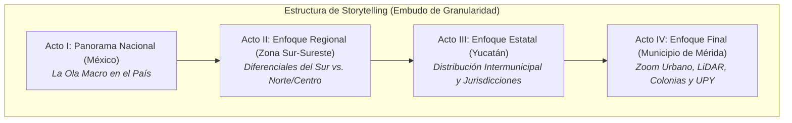
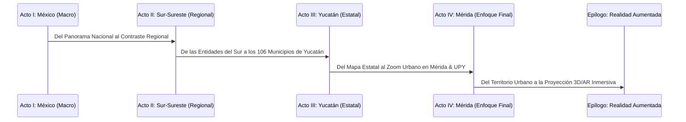

# Mega Análisis de Datos: Storytelling de la Pandemia de COVID-19 (México -> Sur -> Yucatán -> Mérida)

## Resumen Ejecutivo y Narrativa Visual (Storytelling Funnel)

Este documento establece el **libro rector, narrativa de storytelling y catálogo de fuentes de información** para el *Mega Análisis de Visualización de Datos sobre la Pandemia de COVID-19 y su Impacto Socio-Sanitario y Territorial*. 

El proyecto adopta una estructura de **Storytelling en Embudo (Macro a Micro)** que guía al lector a través de una narrativa visual dividida en 4 Actos Principales:

---

## 1. La Estructura Narrativa del Libro (Storytelling Arc)

| Acto / Capítulo | Ámbito Territorial | Hilo Narrativo (Storytelling) | Pregunta Clave de Investigación | Fuentes Principales |
| :--- | :--- | :--- | :--- | :--- |
| **Acto I** | **México (Nacional)** | **La Gran Fotografía:** Cómo penetró la pandemia en México, patrones de transmisión nacional, olas de contagio y tasa de letalidad nacional. | ¿Cómo se posicionó la epidemia en México a nivel macro comparado con otros fenómenos nacionales? | Base Abierta DGE Salud, INEGI Censo. |
| **Acto II** | **Zona Sur-Sureste** | **El Contraste Regional:** Análisis comparativo del Sur-Sureste (Yucatán, Quintana Roo, Campeche, Tabasco, Chiapas, Oaxaca, Veracruz) observando brechas de desarrollo e impacto. | ¿Qué particularidades socio-sanitarias caracterizaron la dinámica del Sur-Sureste frente al resto del país? | DGE Salud, CONAPO, INEGI. |
| **Acto III** | **Estado de Yucatán** | **La Dinámica Estatal:** Radiografía de los 106 municipios de Yucatán, las 3 Jurisdicciones Sanitarias (1-Mérida, 2-Valladolid, 3-Ticul) y la brecha entre el interior y la zona metropolitana. | ¿Cómo se propagó el virus entre la capital y los municipios rurales e indígenas de Yucatán? | SIEGY, Transparencia SSY, DGE Salud, Web Scraping Prensa. |
| **Acto IV** | **Municipio de Mérida (Enfoque Final)** | **El Zoom de Máxima Resolución:** La capital Mérida como el núcleo epidémico y de salud del estado, analizado a nivel de colonias, comisarías (Caucel, Komchén, Dzityá), DENUE, LiDAR y la comunidad UPY. | ¿Cómo responde la infraestructura urbana de Mérida y su población universitaria ante la crisis sanitaria? | GeoPortal Mérida, DENUE, LiDAR, Encuesta UPY (Propia), PNT. |
| **Epílogo** | **Biología & AR 3D** | **La Dimensión Molecular y Tridimensional:** Integración en Realidad Aumentada de la proteína del virus (PDB) y relieve 3D de la epidemia en Mérida. | ¿Cómo se conecta la estructura biológica microscópica con el impacto espacial 3D en la ciudad? | Protein Data Bank (6VXX), WebXR / Three.js. |

---

## 2. Matriz de Fuentes de Información por Origen (Las 9 Fuentes del Pizarrón)

Se han integrado y contextualizado las 9 tipologías de fuentes requeridas en el pizarrón dentro del flujo narrativo:

### 1. Federal (Abierto) - INEGI / DENUE (Sector Salud)
- **Origen:** Instituto Nacional de Estadística y Geografía (INEGI).
- **Dataset:** Directorio Nacional de Unidades Económicas (DENUE) - Sector 62 (Salud y Asistencia Social).
- **Aplicación Narrativa:** Mapeo de la oferta médica en la región Sur y cuantificación exacta de la capacidad de respuesta en Mérida (hospitales, consultorios privados, farmacias y laboratorios).
- **Variables Clave:** `id`, `nom_estab`, `codigo_act`, `per_ocu`, `cve_mun` (`31050` Mérida), `latitud`, `longitud`.

### 2. Federal (Abierto) - Datos.gob.mx / DGE Secretaría de Salud (Base COVID-19)
- **Origen:** Dirección General de Epidemiología (DGE), Secretaría de Salud de México.
- **Dataset:** Base de Datos Abiertos Histórica de COVID-19 en México.
- **Aplicación Narrativa:** Construcción del embudo desde las curvas nacionales (Acto I), el comportamiento del Sur-Sureste (Acto II), la filtración para Yucatán (`ENTIDAD_RES = 31`) (Acto III) y el municipio de Mérida (`MUNICIPIO_RES = 050`) (Acto IV).
- **Variables Clave:** `FECHA_INGRESO`, `EDAD`, `SEXO`, `CLASIFICACION_FINAL`, `TIPO_PACIENTE`, `INTUBADO`, `UCI`, `DIABETES`, `HIPERTENSION`, `OBESIDAD`, `FECHA_DEF`.

### 3. Estatal (Abierto) - SIEGY (Sistema de Información Estadística y Geográfica de Yucatán)
- **Origen:** Gobierno del Estado de Yucatán / SIEGY / CEIEG.
- **Dataset:** Indicadores Socioeconómicos, Demográficos y Capacidad de Salud Estatal.
- **Aplicación Narrativa:** Alimentación del Acto III (Estado de Yucatán) comparando los 106 municipios en términos de marginalidad, población vulnerable y camas hospitalarias por Jurisdicción Sanitaria.
- **Variables Clave:** `cve_municipio`, `nombre_municipio`, `poblacion_total`, `indice_marginacion`, `camas_hospitalarias`, `jurisdiccion_sanitaria`.

### 4. Municipal (Abierto) - GeoPortal del Ayuntamiento de Mérida
- **Origen:** Dirección de Tecnologías de la Información / Desarrollo Urbano, Ayuntamiento de Mérida.
- **Dataset:** Capas de Información Geográfica del Municipio de Mérida.
- **Aplicación Narrativa:** Alimentación del Acto IV (Enfoque Final Mérida) mediante la delimitación de colonias, fraccionamientos, comisarías (Caucel, Komchén, Chablekal, Dzityá, etc.) y módulos de atención municipal.
- **Variables Clave:** `cve_colonia`, `nombre_comisaria`, `tipo_equipamiento`, `geometry`.

### 5. Transparencia / Solicitud Gov - Plataforma Nacional de Transparencia (PNT / Infomex)
- **Origen:** Solicitudes de información pública dirigidas a la Secretaría de Salud de Yucatán (SSY), IMSS e ISSSTE.
- **Dataset:** Inventario diario/mensual de insumos de protección personal (EPP), camas UCI y ventiladores ocupados en nosocomios de Mérida (2020-2022).
- **Aplicación Narrativa:** Revelar en el Acto IV la presión operacional interna en los hospitales de Mérida (Hospital O'Horán, UMAE T1 IMSS, HR ISSSTE Mérida).
- **Variables Clave:** `fecha`, `hospital`, `camas_uci_ocupadas`, `ventiladores_en_uso`, `piezas_epp`.

### 6. Web Scraping - Comunicados de Prensa Oficiales y Noticias del Sur/Yucatán
- **Origen:** Minería de datos web en comunicados oficiales del Gobierno de Yucatán (`yucatan.gob.mx`) y portales informativos del Sur (ej. *Diario de Yucatán*, *Por Esto!*).
- **Herramientas:** Python (BeautifulSoup, Selenium, Scrapy).
- **Aplicación Narrativa:** Enriquecer los Actos III y IV con análisis de sentimiento, cronología de medidas cautelares (toque de queda nocturno, ley seca) y mapa de sedes de vacunación en Mérida (Siglo XXI, Kukulcán, Villa Palmira).
- **Variables Clave:** `fecha_publicacion`, `titular`, `texto_comunicado`, `casos_reportados_dia`, `sedes_vacunacion`.

### 7. Self-produced data - Encuesta de Salud y Percepción (UPY & Mérida)
- **Origen:** Captura directa mediante cuestionario digital (Google Forms / KoboToolbox) aplicado a la comunidad de la Universidad Politécnica de Yucatán (UPY) y habitantes de Mérida.
- **Aplicación Narrativa:** Aportar el componente humano y micro-local al Acto IV (Enfoque Final Mérida), capturando la prevalencia de secuelas Long-COVID, hábitos de prevención y percepción del manejo de la pandemia.
- **Variables Clave:** `edad`, `sexo`, `colonia_merida`, `contagios_covid`, `vacunas_marcas`, `secuelas_long_covid`, `evaluacion_medidas`.

### 8. LiDAR / Datos Altimétricos y Espectrales - INEGI & USGS
- **Origen:** Continuo de Elevación Digital (CEM 3.0) del INEGI y datos LiDAR urbanos de la zona metropolitana de Mérida.
- **Aplicación Narrativa:** Elevar la resolución del Acto IV al terreno tridimensional de Mérida, analizando el entorno construido, la densidad de edificación y la accesibilidad física alrededor de los hospitales.
- **Variables Clave:** Coordenadas `X`, `Y`, `Z` (Elevación), `Classification` (Terreno, Edificios), `Intensity`.

### 9. AR / Realidad Aumentada & Repositorios 3D (Biología y Mapas Volumétricos)
- **Origen:** Protein Data Bank (PDB ID: `6VXX` - Proteína Spike SARS-CoV-2) y mallas 3D geográficas generadas a partir del relieve de contagios en Mérida.
- **Aplicación Narrativa:** Cerrar el libro con un Epílogo Inmersivo (AR), permitiendo al usuario proyectar en 3D/AR tanto la estructura viral como la maqueta tridimensional de la pandemia en Mérida.
- **Variables Clave:** Archivos `.pdb`, `.gltf`, `.obj`, `.usdz` para WebXR.

---

## 3. Catálogo de Visualización de Datos (Organizado por el Storytelling Funnel)

El catálogo de visualizaciones guía al lector a lo largo de la historia, cambiando de escala geográfica y técnica:

### Tabla del Libro de Visualizaciones (15+ Tipos de Gráficos)

| Acto Narrativo | No. | Tipo de Visualización | Fuentes Utilizadas | Tecnología | Hilo del Storytelling |
| :--- | :---: | :--- | :--- | :--- | :--- |
| **Acto I: México** | **1** | **Curva Epidémica Nacional Integrada** | DGE Salud Nacional | Seaborn / Plotly | Muestra las 5 grandes olas pandémicas que impactaron a México a lo largo del tiempo. |
| **Acto I: México** | **2** | **Mapa de Coropletas de México** | DGE Salud + INEGI | Folium / Plotly | Muestra la distribución de la tasa acumulada de casos por cada 100k habitantes a nivel entidad federal. |
| **Acto II: Sur** | **3** | **Gráfico de Barras Agrupadas Regional** | DGE Salud | ggplot2 (R) | Compara el comportamiento de Yucatán vs. Quintana Roo, Campeche, Tabasco, Chiapas, Oaxaca y Veracruz. |
| **Acto II: Sur** | **4** | **Pirámide Poblacional de Mortalidad** | DGE Salud + INEGI | Plotly / D3.js | Revela el exceso de mortalidad por sexo y edades en los estados de la región Sur-Sureste. |
| **Acto III: Yucatán** | **5** | **Mapa Coroplético Intermunicipal** | DGE Salud + SIEGY | Folium / D3.js | Mapea el impacto de la pandemia en los 106 municipios de Yucatán, contrastando Mérida con el interior. |
| **Acto III: Yucatán** | **6** | **Ridgeline Plot (Joyplot)** | DGE Salud Yucatán | ggridges (R) | Visualiza el cambio en la distribución de edad de los hospitalizados en Yucatán mes a mes. |
| **Acto III: Yucatán** | **7** | **Diagrama de Radar (Spider Chart)** | SIEGY + CONAPO | Chart.js / Plotly | Evalúa el perfil de vulnerabilidad (pobreza, camas/hab) entre los municipios más poblados de Yucatán. |
| **Acto III: Yucatán** | **8** | **Matriz de Correlación Heatmap** | SIEGY + DGE Salud | Seaborn / R corrplot | Explora la correlación entre el índice de marginación municipal en Yucatán y la tasa de letalidad. |
| **Acto III: Yucatán** | **9** | **Diagrama de Red NLP (Scraping)** | Scraping Prensa | NetworkX / D3 Force | Muestra las palabras clave y temas más discutidos en la prensa local de Yucatán durante las olas. |
| **Acto IV: Mérida** | **10** | **Mapa de Isócronas y Buffers** | GeoPortal Mérida + DENUE | Geopandas / Leaflet | Mide el tiempo de traslado hacia centros de salud desde las comisarías y colonias periféricas de Mérida. |
| **Acto IV: Mérida** | **11** | **Diagrama de Sankey (Patient Flow)** | DGE Salud (Mérida) | D3.js / Plotly | Sigue la trayectoria de los pacientes en Mérida desde su diagnóstico hasta su alta o defunción. |
| **Acto IV: Mérida** | **12** | **Treemap Jerárquico de Comorbilidades**| DGE Salud (Mérida) | Plotly / D3.js | Muestra la combinación de comorbilidades (Diabetes, Hipertensión, Obesidad) en los casos graves de Mérida. |
| **Acto IV: Mérida** | **13** | **Raincloud Plot (Boxplot + Stripplot)**| Transparencia + DGE | ggplot2 / Seaborn | Analiza los días transcurridos hasta la atención médica según institución en Mérida (IMSS, ISSSTE, SSY). |
| **Acto IV: Mérida** | **14** | **Gráfico Likert de Encuesta UPY** | Encuesta UPY (Propia) | Seaborn / Plotly | Ilustra los hallazgos de la encuesta propia: prevalencia de Long-COVID y valoración de medidas sanitarias. |
| **Acto IV: Mérida** | **15** | **Superficie 3D LiDAR + DENUE** | LiDAR + DENUE + DGE | Three.js / Plotly 3D | Visualiza en 3D la trama urbana de Mérida, asociando la altimetría de edificios con la densidad médica. |
| **Epílogo: AR** | **16** | **Visor Molecular en Realidad Aumentada**| PDB ID: 6VXX | Three.js / WebXR | Proyección interactiva en AR de la proteína Spike del SARS-CoV-2 para contextualización biológica. |
| **Epílogo: AR** | **17** | **Mapa de Relieve 3D en AR de Mérida** | DGE + GeoPortal Mérida | Three.js / AR.js | Experiencia de Realidad Aumentada proyectando el mapa tridimensional de contagios de Mérida sobre una mesa. |

---

## 4. Pipeline de Procesamiento de Datos (ETL Multinivel)

Para alimentar la narrativa de storytelling desde México hasta Mérida, el pipeline seguirá los siguientes pasos:

1. **Ingesta Multinivel:**
   - Descarga de la base nacional DGE COVID-19 y segmentación en 4 subsets: Nacional, Sur-Sureste, Yucatán (`31`) y Mérida (`31050`).
   - Carga de capas vectoriales GeoJSON del GeoPortal de Mérida y del DENUE INEGI.
   - Ingesta de archivos LiDAR `.LAS`/`.LAZ` de la zona metropolitana de Mérida.
2. **Estandarización y Vinculación (Key Join):**
   - Estandarización del código de municipio `CVEGEO` (Ej. `31050` para Mérida, `31096` para Valladolid, `31089` para Tizimín).
   - Armonización de fechas a estándar ISO 8601 (`YYYY-MM-DD`) para sincronizar las series de tiempo.
3. **Generación de Indicadores para Storytelling:**
   - Tasas relativas por cada 100,000 habitantes utilizando la población del Censo 2020 (INEGI/SIEGY).
   - Cálculo de distancias euclidianas y de red vial desde comisarías de Mérida a unidades DENUE de salud.

---

## 5. Conclusión y Hoja de Ruta

El plan de trabajo y recolección de fuentes queda **completamente alineado con la estructura de Storytelling solicitada**:
- **Inicio:** El panorama general de México (Nacional).
- **Desarrollo Regional:** La comparativa de la Zona Sur-Sureste.
- **Profundización Estatal:** El comportamiento en los 106 municipios de Yucatán.
- **Clímax y Enfoque Final:** El zoom de alta precisión en el Municipio de Mérida, sus colonias, comisarías, datos LiDAR y encuesta universitaria (UPY).
- **Cierre Inmersivo:** Experiencias tridimensionales en Realidad Aumentada (AR).

Este documento se constituye como la guía oficial para el desarrollo técnico y visual en las siguientes fases del proyecto.
