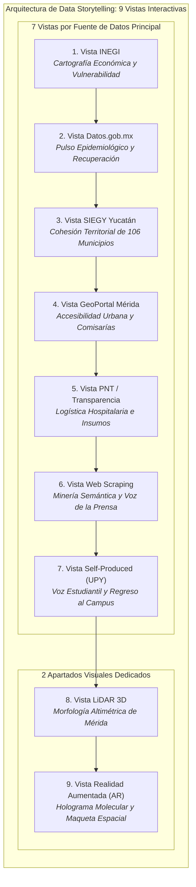
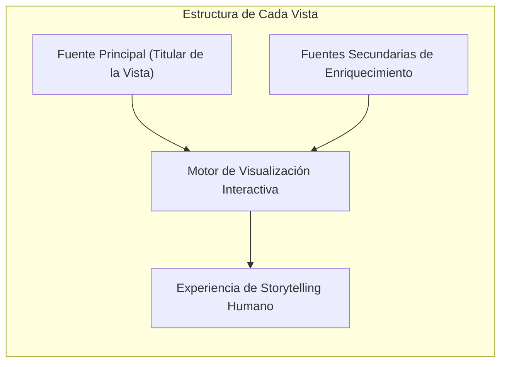

# Data Storytelling: El Viaje de la Resiliencia, la Ciencia y la Comunidad (México -> Sur -> Yucatán -> Mérida & UPY)

## Resumen Ejecutivo de la Arquitectura de Visualización

Este libro rector define la arquitectura de **Data Storytelling Interactivo** para el análisis socio-sanitario, territorial y comunitario. El proyecto adopta una estructura modular en la cual el usuario navega a través de **9 Vistas / Pestañas Temáticas de Visualización Avanzada**:
- **7 Vistas guiadas por Fuentes de Datos Principales**, donde cada vista tiene una fuente titular protagónica enriquecida transversalmente por fuentes secundarias.
- **2 Apartados Tecnológicos Especiales** (**LiDAR** y **Realidad Aumentada - AR**), los cuales no son fuentes de datos convencionales sino **experiencias de visualización inmersivas y volumétricas** generadas a partir de la información geoespacial, biológica y demográfica procesada en las vistas anteriores.

> [!IMPORTANT]
> **Enfoque de Visualización vs. Gráficas Básicas:**
> El proyecto no presenta simples gráficas estáticas o barras aisladas. Cada módulo es una **experiencia visual interactiva y rica** (mapas de isócronas, diagramas de Sankey dinámicos, grafos semánticos D3, mapas coropléticos interactivos, nubes de lluvia/rainclouds, modelos volumétricos LiDAR y visores WebXR en Realidad Aumentada) inmersos en un hilo de **Storytelling humano, positivo y cautivador**.

---

```mermaid
flowchart TD
    subgraph Storytelling ["Arquitectura de Data Storytelling: 9 Vistas Interactivas"]
        direction TB
        subgraph Fuentes ["7 Vistas por Fuente de Datos Principal"]
            V1["1. Vista INEGI<br><i>Cartografía Económica y Vulnerabilidad</i>"]
            V2["2. Vista Datos.gob.mx<br><i>Pulso Epidemiológico y Recuperación</i>"]
            V3["3. Vista SIEGY Yucatán<br><i>Cohesión Territorial de 106 Municipios</i>"]
            V4["4. Vista GeoPortal Mérida<br><i>Accesibilidad Urbana y Comisarías</i>"]
            V5["5. Vista PNT / Transparencia<br><i>Logística Hospitalaria e Insumos</i>"]
            V6["6. Vista Web Scraping<br><i>Minería Semántica y Voz de la Prensa</i>"]
            V7["7. Vista Self-Produced (UPY)<br><i>Voz Estudiantil y Regreso al Campus</i>"]
        end
        
        subgraph Inmersivas ["2 Apartados Visuales Dedicados"]
            V8["8. Vista LiDAR 3D<br><i>Morfología Altimétrica de Mérida</i>"]
            V9["9. Vista Realidad Aumentada (AR)<br><i>Holograma Molecular y Maqueta Espacial</i>"]
        end
        
        V1 --> V2 --> V3 --> V4 --> V5 --> V6 --> V7 --> V8 --> V9
    end
```

---

## 1. Matriz de las 9 Vistas de Visualización

| No. | Nombre de la Vista / Pestaña | Fuente de Datos Principal | Fuentes Secundarias de Apoyo | Tipo de Visualización Compleja | Eje de Storytelling |
| :---: | :--- | :--- | :--- | :--- | :--- |
| **1** | **Módulo INEGI** | **INEGI** (DENUE Sector 62 & Censo de Población 2020) | Datos.gob.mx, SIEGY | **Explorador Cartográfico Multiescalar con Clusters Dinámicos** | *La Red que nos Cuida:* Distribución territorial de la infraestructura de salud pública y privada frente a la concentración de población. |
| **2** | **Módulo Datos.gob.mx** | **Datos.gob.mx** (Base DGE - Secretaría de Salud) | INEGI, PNT | **Diagrama de Sankey Dinámico + Curvas de Recuperación Temporal** | *La Curva de la Esperanza:* Flujo de atención clínica, altas médicas y superación de las olas de contagio a nivel nacional y regional. |
| **3** | **Módulo SIEGY Yucatán** | **SIEGY** (Sistema de Información Estadística y Geográfica de Yucatán) | Datos.gob.mx, DENUE | **Radar Multidimensional & Mapa de Jurisdicciones Sanitarias** | *El Latido del Mayab:* Sinergia y apoyo mutuo entre los 106 municipios del interior del estado y la zona metropolitana. |
| **4** | **Módulo GeoPortal Mérida** | **GeoPortal del Ayuntamiento de Mérida** (Capas SIG) | DENUE, Self-Produced Data | **Mapa de Isócronas y Accesibilidad Urbana a Pie/Transporte** | *La Ciudad de 15 Minutos:* Tiempos de traslado vecinal a centros de salud, parques y puntos de vacunación en colonias y comisarías. |
| **5** | **Módulo Transparencia (PNT)** | **Plataforma Nacional de Transparencia (PNT / SSY)** | Datos.gob.mx, DENUE | **Raincloud Plots & Matriz de Suministro Hospitalario** | *Héroes de Blanco y Logística de Vida:* Agilidad de respuesta y distribución de insumos médicos en hospitales ancla (O'Horán, T1 IMSS). |
| **6** | **Módulo Web Scraping** | **Web Scraping** (Prensa del Sur: Diario de Yucatán, Por Esto!, Gacetas) | Datos.gob.mx | **Red de Co-ocurrencia Semántica (D3 Force) y Análisis de Sentimiento** | *La Prensa que Informó y Unió:* Crónica visual y sentimiento comunitario durante las jornadas de vacunación masiva. |
| **7** | **Módulo Self-Produced Data** | **Encuesta Universitaria UPY** (Levantamiento propio) | GeoPortal Mérida, DGE Salud | **Dashboard Demoscópico Interactivo & Escalas Likert Dinámicas** | *Voces Universitarias:* Adaptación al aprendizaje remoto, hábitos saludables, bienestar mental y la resiliencia en el campus UPY. |
| **8** | **Módulo LiDAR 3D** | *Alimentado por Continuo de Elevación INEGI + LiDAR Mérida* | DENUE, GeoPortal | **Maqueta Altimétrica 3D Interactiva (Deck.gl / Three.js)** | *Mérida en Tres Dimensiones:* Relieve urbano, dosel vegetal y morfología tridimensional de la ciudad asociada a zonas de equipamiento. |
| **9** | **Módulo Realidad Aumentada (AR)**| *Alimentado por PDB ID 6VXX + Geometrías Urbanas Mérida* | WebXR, Three.js, AR.js | **Holograma Molecular Spike & Maqueta de Mesa en AR** | *La Ciencia en tus Manos:* Proyección holográfica del complejo viral de la vacuna y mapa 3D interactivo sobre el escritorio del usuario. |

---

## 2. Detalle de Cada Vista: Fuentes, Datos y Experiencia Visual

```mermaid
graph LR
    subgraph Arquitectura_Vista ["Estructura de Cada Vista"]
        FP["Fuente Principal (Titular de la Vista)"] --> Engine["Motor de Visualización Interactiva"]
        FS["Fuentes Secundarias de Enriquecimiento"] --> Engine
        Engine --> Story["Experiencia de Storytelling Humano"]
    end
```

### Vista 1: Módulo INEGI — Cartografía Económica y Vulnerabilidad Territorial
- **Fuente Principal:** INEGI (Directorio Nacional de Unidades Económicas - DENUE 2020-2024, Censo de Población y Vivienda).
- **Fuentes Complementarias:** Base Abierta de Salud (Datos.gob.mx) para cruce de demanda, SIEGY para índices de marginación.
- **Experiencia de Visualización:** 
  - *Mapa de Densidad y Clusterización Dinámica:* Mapeo interactivo en capas con filtrado por tipo de unidad médica (consultorios, clínicas, hospitales de alta especialidad, farmacias).
  - *Buscador de Proximidad:* Cálculo dinámico del radio de cobertura médica por cada 10,000 habitantes.
- **Storytelling:** *La Red que nos Cuida.* Demuestra cómo la red de infraestructura médica distribuida en la península y en Mérida fue la primera línea de contención y acompañamiento para las familias.

---

### Vista 2: Módulo Datos.gob.mx — El Pulso Epidemiológico y la Curva de Recuperación
- **Fuente Principal:** Datos.gob.mx / Dirección General de Epidemiología (DGE - Secretaría de Salud Federal).
- **Fuentes Complementarias:** INEGI (Estructura de grupos etarios), Transparencia (Capacidades de camas UCI).
- **Experiencia de Visualización:**
  - *Diagrama de Flujo de Pacientes (Sankey Interactivo):* Visualización dinámica que rastrea el viaje del paciente: Detección -> Tipo de Tratamiento Ambulatorio/Hospitalario -> Alta Médica Exitosa.
  - *Línea de Tiempo Interactiva con Scrubbing:* Control deslizante para observar la aceleración de altas médicas y efectividad de los esquemas de vacunación a lo largo de las olas.
- **Storytelling:** *La Curva de la Esperanza.* Una narrativa enfocada no en la tragedia, sino en la victoria científica, el alto porcentaje de personas recuperadas y el esfuerzo incansable del personal sanitario.

---

### Vista 3: Módulo SIEGY Yucatán — Cohesión Territorial de los 106 Municipios
- **Fuente Principal:** SIEGY (Sistema de Información Estadística y Geográfica de Yucatán / CEIEG).
- **Fuentes Complementarias:** Datos.gob.mx (Incidencia estatal), DENUE (Centros de salud municipales).
- **Experiencia de Visualización:**
  - *Radar Multidimensional (Spider Chart Interactivo):* Comparador dinámico de municipios por Jurisdicción Sanitaria (Mérida, Valladolid, Ticul), evaluando cobertura, conectividad e índice de resiliencia social.
  - *Mapa Coroplético Bivariado:* Cruce visual entre índice de marginación y velocidad de cobertura de programas sociales y de salud.
- **Storytelling:** *El Latido del Mayab.* Muestra cómo la solidaridad y el trabajo coordinado entre la capital yucateca y las comunidades mayahablantes del interior fortalecieron el tejido social.

---

### Vista 4: Módulo GeoPortal de Mérida — Accesibilidad Urbana y Vida en las Comisarías
- **Fuente Principal:** GeoPortal del Ayuntamiento de Mérida (Dirección de Desarrollo Urbano / Catastro).
- **Fuentes Complementarias:** DENUE (Puntos de vacunación masiva y consultorios de barrio), Self-Produced Data (Rutas de viaje).
- **Experiencia de Visualización:**
  - *Mapa de Isócronas Urbanas:* Visualización interactiva que traza polígonos de tiempo de traslado (5, 10, 15 y 20 minutos caminando y en transporte público) hacia parques públicos, clínicas y sedes de vacunación.
  - *Explorador Territorial de Comisarías:* Zoom interactivo a comisarías del norte, poniente, sur y oriente (Caucel, Komchén, Dzityá, Chablekal, Cholul, Los Héroes).
- **Storytelling:** *La Ciudad a Escala Humana.* La vivencia cotidiana de Mérida, evidenciando la importancia de los espacios públicos y la cercanía de los servicios para la calidad de vida de sus habitantes.

---

### Vista 5: Módulo Transparencia (PNT) — Logística Hospitalaria e Insumos Médicos
- **Fuente Principal:** Solicitudes de Información a la SSY, IMSS e ISSSTE vía Plataforma Nacional de Transparencia (PNT / Infomex).
- **Fuentes Complementarias:** Datos.gob.mx (Ocupación de camas UCI), DENUE (Hospitales de referencia).
- **Experiencia de Visualización:**
  - *Raincloud Plot Interactivo:* Nube de distribución estadística y puntos de datos individuales que comparan los tiempos de reabastecimiento y distribución de Equipos de Protección Personal (EPP).
  - *Matriz de Dotación por Hospital:* Diagrama de calor que refleja la capacidad de respuesta logística en los principales centros hospitalarios de la región (Hospital Agustín O'Horán, Clínica T1 IMSS, Hospital Regional ISSSTE).
- **Storytelling:** *Héroes de Blanco y Logística de Vida.* La historia invisible detrás del escenario: la sincronización logística para dotar de insumos y equipamiento a quienes estaban en la primera línea.

---

### Vista 6: Módulo Web Scraping — Minería Semántica y la Voz de la Prensa del Sur
- **Fuente Principal:** Web Scraping automatizado en medios locales y comunicados gubernamentales (*Diario de Yucatán*, *Por Esto!*, boletines del Gobierno del Estado).
- **Fuentes Complementarias:** Datos.gob.mx (Fechas clave de jornadas sanitarias).
- **Experiencia de Visualización:**
  - *Grafo de Red Semántica (D3.js Force-Directed Graph):* Red interactiva de nodos donde se exploran las conexiones entre conceptos clave (*solidaridad, vacunación, UPY, Siglo XXI, apertura, cuidado*).
  - *Curva de Sentimiento Colectivo:* Análisis cronológico de polaridad textual que muestra el tránsito de la incertidumbre inicial hacia el optimismo y la reapertura comunitaria.
- **Storytelling:** *La Prensa que Informó y Unió.* Cómo la comunicación responsable y la cobertura de los medios locales motivaron a la ciudadanía a acudir con entusiasmo a las jornadas cívicas de vacunación.

---

### Vista 7: Módulo Self-Produced Data — La Voz Universitaria UPY
- **Fuente Principal:** Dataset propio generado a partir de la Encuesta Digital Estudiantil UPY y Percepción Comunitaria de Mérida.
- **Fuentes Complementarias:** GeoPortal de Mérida (Distribución espacial de las residencias de los alumnos), Datos.gob.mx (Factores de referencia).
- **Experiencia de Visualización:**
  - *Dashboard Demoscópico Interactivo:* Paneles de selección dinámica con barras divergentes (Escalas Likert) que exploran hábitos de estudio, adaptación tecnológica, deporte, bienestar emocional y hábitos post-pandemia.
  - *Mapa de Calor de Movilidad Estudiantil:* Flujos de viaje desde distintas zonas de Mérida hacia el campus de la Universidad Politécnica de Yucatán.
- **Storytelling:** *Nuestra Universidad, Nuestro Futuro.* La mirada fresca y viva de los estudiantes de la UPY: cómo la innovación, la tecnología y el compañerismo permitieron una transición exitosa a la nueva normalidad.

---

### Vista 8: Apartado Especial LiDAR — Maqueta Altimétrica y Morfología 3D de Mérida
- **Naturaleza del Módulo:** Visualización Altimétrica y Modelado Volumétrico Tridimensional.
- **Fuentes Nutrientes:** Continuo de Elevación Digital (CEM 3.0) del INEGI + Datos LiDAR Urbanos de Mérida + Capas DENUE.
- **Experiencia de Visualización:**
  - *Visor 3D Interactivo de Nube de Puntos / Malla Extruida:* Modelo tridimensional de la trama urbana de Mérida con navegación libre (rotación, pitch, zoom).
  - *Capas Temáticas Iluminadas:* Las alturas y densidades urbanas se iluminan según su cercanía a equipamiento de salud y corredores de ventilación urbana.
- **Storytelling:** *Mérida en Tres Dimensiones.* Una experiencia estética de vanguardia que revela la topografía plana pero rica en infraestructura de la capital yucateca, uniendo datos duros con diseño espacial.

---

### Vista 9: Apartado Especial Realidad Aumentada (AR) — Inmersión Molecular y Proyección Espacial
- **Naturaleza del Módulo:** Experiencia Inmersiva WebXR y Proyección Espacial de Realidad Aumentada.
- **Fuentes Nutrientes:** Protein Data Bank (PDB ID: `6VXX` - Estructura de la Espícula de SARS-CoV-2 y diseño de vacunas de ARNm) + Modelos 3D de la UPY y Mérida.
- **Experiencia de Visualización:**
  - *Holograma Molecular en tu Mesa:* Proyección en Realidad Aumentada (mediante cámara del dispositivo) de la estructura de la proteína para interactuar con sus sitios de unión con rotación táctil.
  - *Maqueta Urbana AR:* Proyección flotante en el espacio real de la maqueta territorial de Mérida y el campus UPY.
- **Storytelling:** *La Ciencia en tus Manos.* El cierre magistral del viaje: la tecnología permite al lector tocar la ciencia a nivel atómico y contemplar su ciudad proyectada en su propio espacio físico.

---

## 3. Guía de Estética, Experiencia de Usuario y Componentes (Design System)

Para asegurar que la entrega deslumbre visualmente al docente y a los lectores, se implementa el siguiente sistema de diseño:

- **Estructura de Navegación (Tabs & Scrollytelling):**
  - Barra de navegación superior/lateral fluida con accesos directos a las 9 Vistas.
  - Indicador claro de **Fuente Principal Titular** e insignias de **Fuentes Complementarias**.
- **Paleta de Colores Curada:**
  - *Accent Primario (Tecnología y Esperanza):* Gradiente Cian Eléctrico a Azul Índigo (`#00F2FE` -> `#4FACFE`).
  - *Accent Secundario (Calidez y Resiliencia):* Gradiente Coral Atardecer a Ámbar Dorado (`#FF7E5F` -> `#FEB47B`).
  - *Fondo & Superficies:* Slate Dark (`#0F172A`) con micro-texturas y Glassmorphism (paneles translúcidos con desenfoque de fondo y bordes de 1px con brillo sutil).
- **Tipografía:**
  - *Headings:* `Outfit` / `Plus Jakarta Sans` (Geométrica, moderna y de gran impacto).
  - *Cuerpo y Datos:* `Inter` / `JetBrains Mono` para cifras y métricas clave.

---

## 4. Pipeline Técnico de Integración de Datos (ETL y Servicios)

1. **Extracción y Limpieza:**
   - Scripts modulares en Python (`scripts/etl/`) para procesar cada una de las 7 fuentes de datos y estructurarlas en formatos optimizados (`.parquet`, `.geojson`, `.json`).
2. **Generación de Entornos 3D y Modelos AR:**
   - Procesamiento de archivos `.las`/`.laz`/`.tif` de LiDAR hacia formatos ligeros para renderizado WebGL (Three.js / Deck.gl).
   - Conversión de estructuras PDB a modelos `.gltf`/`.usdz` optimizados para WebXR.
3. **Despliegue Web Interactivo:**
   - Aplicación web responsiva con soporte táctil en móviles, tablets y monitores de alta resolución.
