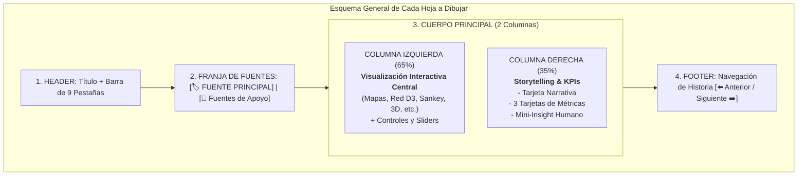

# Guía Maestra de Bocetaje y Wireframing a Mano: Prototipo de 9 Vistas
### *Manual para dibujar a mano el prototipo de Data Storytelling (Storyboards & Wireframes)*

---

## 🎨 Instrucciones Generales para el Dibujante a Mano

Esta guía está diseñada para que cualquier persona del equipo pueda tomar hojas de papel (o una libreta en blanco / cartulina / iPad) y dibujar a mano alzada las **9 pantallas del prototipo**.

### Convenciones Visuales Recomendadas para el Dibujo:
- **Estructura Común (Layout Base en todas las hojas):**
  1. **Encabezado Superior (Header):** Título del proyecto + Barra de pestañas navegables (9 botones).
  2. **Franja de Atribución de Fuentes:** 
     - Cuadro destacado a la izquierda: `[🏷️ FUENTE PRINCIPAL: <Nombre de la Fuente>]`
     - Texto a la derecha: `[🔗 Fuentes de Apoyo: <Fuente 2, Fuente 3>]`
  3. **Cuerpo Central Dividido en 2 Columnas:**
     - **Columna Izquierda (65% del ancho):** **Área Principal de Visualización Interactiva** (el mapa, el grafo de red, el Sankey, el visor 3D, etc.).
     - **Columna Derecha (35% del ancho):** **Panel de Storytelling & Métricas Clave** (Tarjeta de contexto humano, 3 KPIs con números grandes, y controles interactivos como sliders de tiempo o selectores de capas).
  4. **Pie de Pantalla (Footer):** Botones de navegación tipo historia `[⬅️ Vista Anterior]  [Siguiente Capítulo ➡️]`.

---



---

## 📋 Detalle de las 9 Vistas para Dibujar a Mano

---

### 🖼️ HOJA 1: VISTA INEGI
**Título en el dibujo:** `Vista 1: Módulo INEGI — Cartografía Económica y Red de Salud`  
**Insignia de Fuentes:**  
- `[🏷️ FUENTE PRINCIPAL: INEGI (DENUE 62 & Censo 2020)]`  
- `[🔗 Fuentes de Apoyo: Datos.gob.mx, SIEGY]`

#### Diagrama de Distribución para el Dibujo (Wireframe ASCII):
```text
+---------------------------------------------------------------------------------------+
| 🌐 DATA STORYTELLING: EL VIAJE DE LA RESILIENCIA | [1.INEGI] [2.Datos] [3.SIEGY] ... |
+---------------------------------------------------------------------------------------+
| 🏷️ FUENTE PRINCIPAL: INEGI (DENUE Sector 62)  |  🔗 Fuentes de Apoyo: Datos.gob.mx, SIEGY |
+---------------------------------------------------+-----------------------------------+
|  [ ÁREA DE VISUALIZACIÓN: 65% ]                   |  [ STORYTELLING & METRICS: 35% ]  |
|                                                   |                                   |
|   +-------------------------------------------+   |  📖 LA RED QUE NOS CUIDA          |
|   |  MAPA DE CALOR Y CLUSTERS (SUR & MÉRIDA)  |   |  "Cómo la red de consultorios de  |
|   |                                           |   |  barrio y hospitales protegió a   |
|   |      (●) Mérida [Cluster: 3,420 Unidades] |   |  la población yucateca."          |
|   |         \                                 |   |                                   |
|   |          (●) Kanasín                      |   |  📊 MÉTRICAS DESTACADAS:          |
|   |              \                            |   |  +-----------------------------+  |
|   |               (●) Valladolid              |   |  | 🏥 3,842 Unidades Médicas   |  |
|   |                                           |   |  | 👥 9.4 Camas x 1,000 Hab.   |  |
|   |   Leyenda:                                |   |  | ⏱️ 8.2 min Tiempo Promedio  |  |
|   |   🔴 Alta Especialidad  🟡 Consultorios  |   |  +-----------------------------+  |
|   |   🟢 Farmacias y Apoyo de Barrio          |   |                                   |
|   +-------------------------------------------+   |  🎛️ FILTROS INTERACTIVOS:         |
|   [◀ 2020 -------🔘------------------- 2024 ▶]    |  [✓] Sector Público [✓] Privado   |
|   Control deslizante: Expansión de Unidades       |  [Selector: Todos los Municipios] |
+---------------------------------------------------+-----------------------------------+
| [⬅️ Inicio]                                                    [Siguiente: Datos.gob.mx ➡️] |
+---------------------------------------------------------------------------------------+
```

#### Elementos a Dibujar con Lápiz/Plumón:
1. **En el Mapa:** Dibuja el contorno del estado de Yucatán con un zoom a la zona metropolitana de Mérida. Dibuja círculos concéntricos con números adentro representando clusters (ej. "3,420" en Mérida, "180" en Valladolid, "95" en Tizimín).
2. **Leyenda de Colores:** 3 circulitos de colores (Rojo: Hospitales, Amarillo: Clínicas, Verde: Farmacias comunitarias).
3. **Tarjeta de Datos:** Dibuja 3 cajas con iconos:
   - 🏥 `3,842` Unidades de Salud Registradas.
   - 👥 `9.4` Camas por cada 1,000 habitantes en la zona metropolitana.
   - ⏱️ `8.2 min` Distancia promedio urbana a un punto de primer contacto médico.

---

### 🖼️ HOJA 2: VISTA DATOS.GOB.MX
**Título en el dibujo:** `Vista 2: Módulo Datos.gob.mx — El Pulso Epidemiológico y la Recuperación`  
**Insignia de Fuentes:**  
- `[🏷️ FUENTE PRINCIPAL: Datos.gob.mx (DGE Secretaría de Salud)]`  
- `[🔗 Fuentes de Apoyo: INEGI, PNT]`

#### Diagrama de Distribución para el Dibujo (Wireframe ASCII):
```text
+---------------------------------------------------------------------------------------+
| 🌐 DATA STORYTELLING: EL VIAJE DE LA RESILIENCIA | [1.INEGI] [2.Datos] [3.SIEGY] ... |
+---------------------------------------------------------------------------------------+
| 🏷️ FUENTE PRINCIPAL: Datos.gob.mx (DGE Salud) |  🔗 Fuentes de Apoyo: INEGI, PNT     |
+---------------------------------------------------+-----------------------------------+
|  [ ÁREA DE VISUALIZACIÓN: 65% ]                   |  [ STORYTELLING & METRICS: 35% ]  |
|                                                   |                                   |
|   DIAGRAMA DE SANKEY: FLUJO CLÍNICO Y RECUPERACIÓN|  📖 LA CURVA DE LA ESPERANZA      |
|                                                   |  "El 89.4% de los casos atendidos |
|   [ CASOS CONFIRMADOS ]                           |  completaron su recuperación con  |
|          │                                        |  éxito gracias a la vacunación."  |
|          ├───► [ ATENCIÓN AMBULATORIA (82%) ] ──┐ |                                   |
|          │                                      ▼ |  📊 MÉTRICAS DE RECUPERACIÓN:     |
|          └───► [ HOSPITALIZACIÓN (18%) ]        | |  +-----------------------------+  |
|                      │                          | |  | 💚 89.4% Tasa de Altas      |  |
|                      ├──► [ SALA GENERAL ] ─────┼─┼─►| 💉 2.1M Dosis Aplicadas      |  |
|                      │                          │ |  | ⚡ 4.2 Días Prom. Estancia  |  |
|                      └──► [ UCI (4.1%) ] ───────┘ |  +-----------------------------+  |
|                                     │             |                                   |
|                                     ▼             |  🎛️ SELECTORES:                   |
|                        [ ✨ ALTA MÉDICA EXITOSA ] |  Ola: [Ola 1] [Ola 2] [★ Ómicron]  |
|                                                   |  Grupo: [Todas las Edades ▾]      |
+---------------------------------------------------+-----------------------------------+
| [⬅️ Vista INEGI]                                                [Siguiente: SIEGY ➡️] |
+---------------------------------------------------------------------------------------+
```

#### Elementos a Dibujar con Lápiz/Plumón:
1. **Diagrama de Sankey:** Dibuja bandas anchas que se bifurcan de izquierda a derecha. A la izquierda un bloque grueso "Casos Diagnosticados", que se divide en una banda muy ancha "Ambulatorio (82%)" y una más delgada "Hospitalizados (18%)", ambas confluyendo hacia un gran bloque verde a la derecha: "✨ Recuperación y Alta Médica".
2. **Línea de Tiempo con Olas:** Debajo del Sankey, dibuja una curva suave con 4 picos (Olas COVID) donde la curva de recuperación sube drásticamente a partir de la llegada de las vacunas.
3. **KPIs a la Derecha:**
   - 💚 `89.4%` Supervivencia y Altas Médicas.
   - 💉 `2,145,000` Dosis de vacunas registradas en Yucatán.
   - ⚡ `4.2 días` Tiempo medio de resolución ambulatoria.

---

### 🖼️ HOJA 3: VISTA SIEGY YUCATÁN
**Título en el dibujo:** `Vista 3: Módulo SIEGY Yucatán — Cohesión Territorial de los 106 Municipios`  
**Insignia de Fuentes:**  
- `[🏷️ FUENTE PRINCIPAL: SIEGY (Gobierno del Estado de Yucatán)]`  
- `[🔗 Fuentes de Apoyo: Datos.gob.mx, DENUE]`

#### Diagrama de Distribución para el Dibujo (Wireframe ASCII):
```text
+---------------------------------------------------------------------------------------+
| 🌐 DATA STORYTELLING: EL VIAJE DE LA RESILIENCIA | [1] [2] [3.SIEGY] [4] [5] ...      |
+---------------------------------------------------------------------------------------+
| 🏷️ FUENTE PRINCIPAL: SIEGY Yucatán           |  🔗 Fuentes de Apoyo: DGE Salud, DENUE |
+---------------------------------------------------+-----------------------------------+
|  [ ÁREA DE VISUALIZACIÓN: 65% ]                   |  [ STORYTELLING & METRICS: 35% ]  |
|                                                   |                                   |
|   RADAR MULTIDIMENSIONAL DE COHESIÓN MUNICIPAL    |  📖 EL LATIDO DEL MAYAB           |
|                                                   |  "Los 106 municipios sincronizados|
|                 [ Conectividad ]                  |  por 3 Jurisdicciones Sanitarias."|
|                        ▲                          |                                   |
|                     /  |  \                       |  📊 INDICADORES ESTATALES:        |
|      [ Cobertura ] /---|---\ [ Resiliencia ]      |  +-----------------------------+  |
|            ◄------/----+----\------►              |  | 🏛️ 106 Municipios Activos   |  |
|                   \    |    /                     |  | 🤝 3 Jurisdicciones Sanit.  |  |
|                    \---|---/                      |  | 📈 92.1 Índice de Cohesión  |  |
|                        ▼                          |  +-----------------------------+  |
|               [ Red Comunitaria ]                 |                                   |
|                                                   |  🎛️ COMPARADOR MUNICIPAL:         |
|   ── Jurisdicción 1 (Mérida)                      |  [✓] Mérida                       |
|   ┄┄ Jurisdicción 2 (Valladolid)                  |  [✓] Valladolid                   |
|   ┈─ Jurisdicción 3 (Ticul)                       |  [✓] Ticul                        |
+---------------------------------------------------+-----------------------------------+
| [⬅️ Datos.gob.mx]                                     [Siguiente: GeoPortal Mérida ➡️] |
+---------------------------------------------------------------------------------------+
```

#### Elementos a Dibujar con Lápiz/Plumón:
1. **Gráfico de Radar (Spider Web):** Dibuja un pentágono o hexágono con ejes que salgan del centro (Conectividad Vial, Cobertura Médica, Red Comunitaria, Resiliencia Social, Abastecimiento). Dibuja 3 figuras poligonales sobrepuestas de distintos trazos/colores representando Mérida, Valladolid y Ticul.
2. **Mapa de Yucatán Segmentado:** A un costado del radar, un mini mapa de Yucatán dividido en sus 3 grandes regiones sanitarias.
3. **KPIs a la Derecha:**
   - 🏛️ `106` Municipios con monitoreo activo.
   - 🤝 `3` Jurisdicciones Sanitarias coordinadas.
   - 📈 `92.1 / 100` Índice de respuesta y soporte territorial.

---

### 🖼️ HOJA 4: VISTA GEOPORTAL DE MÉRIDA
**Título en el dibujo:** `Vista 4: Módulo GeoPortal de Mérida — Accesibilidad Urbana y Comisarías`  
**Insignia de Fuentes:**  
- `[🏷️ FUENTE PRINCIPAL: GeoPortal del Ayuntamiento de Mérida]`  
- `[🔗 Fuentes de Apoyo: DENUE, Self-Produced]`

#### Diagrama de Distribución para el Dibujo (Wireframe ASCII):
```text
+---------------------------------------------------------------------------------------+
| 🌐 DATA STORYTELLING: EL VIAJE DE LA RESILIENCIA | ... [3] [4.GeoPortal] [5] [6] ...  |
+---------------------------------------------------------------------------------------+
| 🏷️ FUENTE PRINCIPAL: GeoPortal Mérida        |  🔗 Fuentes de Apoyo: DENUE, Encuesta  |
+---------------------------------------------------+-----------------------------------+
|  [ ÁREA DE VISUALIZACIÓN: 65% ]                   |  [ STORYTELLING & METRICS: 35% ]  |
|                                                   |                                   |
|   MAPA DE ISÓCRONAS: "MÉRIDA A 15 MINUTOS"        |  📖 LA CIUDAD A ESCALA HUMANA     |
|                                                   |  "Movilidad vecinal y acceso a    |
|        Komchén (●)                                |  espacios públicos y salud."      |
|               \                                   |                                   |
|          Dzityá (●) --- [ Polígono 15 min ]       |  📊 ACCESIBILIDAD MUNICIPAL:      |
|                   \     /                \        |  +-----------------------------+  |
|      Caucel (●) ─── Centro Histórico ──── Chablekal|  | 🌳 640 Parques y Espacios   |  |
|                   /    [Puntos Vacunación]        |  | 🚶 12.4 min Caminata Media  |  |
|              Kanasín                              |  | 🏘️ 47 Comisarías Integradas |  |
|                                                   |  +-----------------------------+  |
|   Capas:                                          |                                   |
|   [ ] Anillo Periférico  [✓] Sedes Vacunación     |  🎛️ MODO DE TRANSPORTE:           |
|   [✓] Polígonos de Isócronas a Pie (5-15 min)     |  (•) Caminata  ( ) Bicicleta/Bus  |
+---------------------------------------------------+-----------------------------------+
| [⬅️ Vista SIEGY]                                      [Siguiente: Transparencia PNT ➡️] |
+---------------------------------------------------------------------------------------+
```

#### Elementos a Dibujar con Lápiz/Plumón:
1. **Mapa de Isócronas de Mérida:** Dibuja el óvalo del Anillo Periférico de Mérida. Adentro y afuera coloca puntos destacados para las comisarías (Komchén al norte, Caucel al poniente, Chablekal al nororiente). Alrededor de centros de salud y sedes masivas (Siglo XXI, Kukulcán) dibuja ondas o polígonos concéntricos simulando 5, 10 y 15 minutos de caminata.
2. **KPIs a la Derecha:**
   - 🌳 `640` Espacios públicos y parques activos como pulmones de esparcimiento.
   - 🚶 `12.4 min` Tiempo promedio de traslado peatonal a servicios esenciales.
   - 🏘️ `47` Comisarías conectadas con la red de atención municipal.

---

### 🖼️ HOJA 5: VISTA TRANSPARENCIA (PNT)
**Título en el dibujo:** `Vista 5: Módulo Transparencia — Logística Hospitalaria e Insumos Médicos`  
**Insignia de Fuentes:**  
- `[🏷️ FUENTE PRINCIPAL: Plataforma Nacional de Transparencia (PNT / SSY / IMSS)]`  
- `[🔗 Fuentes de Apoyo: Datos.gob.mx, DENUE]`

#### Diagrama de Distribución para el Dibujo (Wireframe ASCII):
```text
+---------------------------------------------------------------------------------------+
| 🌐 DATA STORYTELLING: EL VIAJE DE LA RESILIENCIA | ... [4] [5.PNT] [6] [7] ...        |
+---------------------------------------------------------------------------------------+
| 🏷️ FUENTE PRINCIPAL: Solicitudes PNT / SSY   |  🔗 Fuentes de Apoyo: DGE, DENUE       |
+---------------------------------------------------+-----------------------------------+
|  [ ÁREA DE VISUALIZACIÓN: 65% ]                   |  [ STORYTELLING & METRICS: 35% ]  |
|                                                   |                                   |
|   RAINCLOUD PLOT (NUBE + GOTAS) DE SUMINISTRO     |  📖 HÉROES DE BLANCO Y LOGÍSTICA  |
|                                                   |  "La movilización invisible para  |
|   Hospital O'Horán:                               |  equipar hospitales y salvar      |
|    ( Densidad / Nube )      ..::.:.::. (Gotas)    |  vidas."                          |
|   ───────────────────────[■■■■■■]─────────────    |                                   |
|   UMAE T1 IMSS:                                   |  📊 EFICIENCIA LOGÍSTICA:         |
|    ( Densidad / Nube )       .:::..:.. (Gotas)    |  +-----------------------------+  |
|   ────────────────────────[■■■■■]─────────────    |  | 📦 98.2% Abastecimiento EPP |  |
|   HR ISSSTE Mérida:                               |  | ⏱️ 18.5 hrs Reabastecimiento|  |
|    ( Densidad / Nube )         .::.:.. (Gotas)    |  | 🩺 4 Nosocomios Ancla       |  |
|   ──────────────────────────[■■■■]────────────    |  +-----------------------------+  |
|                                                   |                                   |
|   Eje X: Horas de Tiempo de Reabastecimiento      |  🎛️ TIPO DE INSUMO:               |
|   [0h ------------- 24h ------------- 48h]        |  [✓] Mascarillas / EPP [✓] Oxígeno|
+---------------------------------------------------+-----------------------------------+
| [⬅️ GeoPortal Mérida]                                  [Siguiente: Web Scraping ➡️] |
+---------------------------------------------------------------------------------------+
```

#### Elementos a Dibujar con Lápiz/Plumón:
1. **Gráfico Raincloud:** Para cada hospital dibuja una semielipse suave superior (la nube de densidad) y debajo una línea con puntitos dispersos (las gotas de datos individuales) y una pequeña cajita boxplot en medio. Esto representa la rapidez con la que llegaban los insumos de protección.
2. **KPIs a la Derecha:**
   - 📦 `98.2%` Tasa promedio de abastecimiento continuo de Equipos de Protección Personal.
   - ⏱️ `18.5 horas` Tiempo promedio de respuesta en cadenas críticas de suministro.
   - 🩺 `4` Centros Hospitalarios de Alta Especialidad monitoreados.

---

### 🖼️ HOJA 6: VISTA WEB SCRAPING
**Título en el dibujo:** `Vista 6: Módulo Web Scraping — Minería Semántica y la Prensa del Sur`  
**Insignia de Fuentes:**  
- `[🏷️ FUENTE PRINCIPAL: Web Scraping (Prensa Local: Diario de Yucatán, Por Esto!, Gacetas)]`  
- `[🔗 Fuentes de Apoyo: Datos.gob.mx]`

#### Diagrama de Distribución para el Dibujo (Wireframe ASCII):
```text
+---------------------------------------------------------------------------------------+
| 🌐 DATA STORYTELLING: EL VIAJE DE LA RESILIENCIA | ... [5] [6.Scraping] [7] [8] ...   |
+---------------------------------------------------------------------------------------+
| 🏷️ FUENTE PRINCIPAL: Web Scraping de Prensa   |  🔗 Fuentes de Apoyo: Datos.gob.mx    |
+---------------------------------------------------+-----------------------------------+
|  [ ÁREA DE VISUALIZACIÓN: 65% ]                   |  [ STORYTELLING & METRICS: 35% ]  |
|                                                   |                                   |
|   GRAFO DE FUERZA INTERACTIVO (D3 NETWORK)        |  📖 LA PRENSA QUE INFORMÓ Y UNIÓ  |
|                                                   |  "De la incertidumbre a la fiesta |
|               (Solidaridad)                       |  cívica de la vacunación masiva." |
|                  /     \                          |                                   |
|       (Siglo XXI) ----- (Vacunación) ─── (UPY)    |  📊 MINERÍA TEXTUAL:              |
|            |                 |                    |  +-----------------------------+  |
|       (Kukulcán) ────── (Juventud) ─── (Esperanza)|  | 📰 1,420 Artículos Minados  |  |
|                                                   |  | 💚 +76% Sentimiento Positivo|  |
|   --- CRONOLOGÍA DE SENTIMIENTO TEXTUAL ---       |  | 🗣️ 18 Conceptos Clave       |  |
|   Sentimiento (+)   /\          /\                |  +-----------------------------+  |
|   Neutral      (0) ─/──\───────/──\──────         |                                   |
|   Sentimiento (-) /      \____/                   |  🎛️ FILTRO DE PALABRAS:           |
|                    2020   2021   2022             |  [Buscar término: "vacuna"...]    |
+---------------------------------------------------+-----------------------------------+
| [⬅️ Transparencia PNT]                               [Siguiente: Self-Produced UPY ➡️] |
+---------------------------------------------------------------------------------------+
```

#### Elementos a Dibujar con Lápiz/Plumón:
1. **Grafo de Red Semántica (Burbujas conectadas por líneas):** Dibuja círculos flotantes interconectados con palabras: *Vacunación*, *Solidaridad*, *Siglo XXI*, *UPY*, *Kukulcán*, *Esperanza*, *Juventud*. Dibuja círculos más grandes para los términos más frecuentes.
2. **Curva de Sentimiento:** Debajo del grafo, dibuja una onda que sube firmemente hacia la zona positiva en las fechas de las jornadas de vacunación masiva.
3. **KPIs a la Derecha:**
   - 📰 `1,420` Notas informativas y gacetas procesadas con procesamiento de lenguaje natural.
   - 💚 `+76%` Predominio de tono positivo y de aliento comunitario durante la reactivación.
   - 🗣️ `18` Nodos semánticos principales en la red de conversación ciudadana.

---

### 🖼️ HOJA 7: VISTA SELF-PRODUCED DATA (UPY)
**Título en el dibujo:** `Vista 7: Módulo Self-Produced Data — La Voz Universitaria UPY`  
**Insignia de Fuentes:**  
- `[🏷️ FUENTE PRINCIPAL: Encuesta Comunitaria y Estudiantil UPY (Datos Propios)]`  
- `[🔗 Fuentes de Apoyo: GeoPortal Mérida, DGE Salud]`

#### Diagrama de Distribución para el Dibujo (Wireframe ASCII):
```text
+---------------------------------------------------------------------------------------+
| 🌐 DATA STORYTELLING: EL VIAJE DE LA RESILIENCIA | ... [6] [7.SelfData] [8] [9]       |
+---------------------------------------------------------------------------------------+
| 🏷️ FUENTE PRINCIPAL: Encuesta Propia UPY      |  🔗 Fuentes de Apoyo: GeoPortal, DGE   |
+---------------------------------------------------+-----------------------------------+
|  [ ÁREA DE VISUALIZACIÓN: 65% ]                   |  [ STORYTELLING & METRICS: 35% ]  |
|                                                   |                                   |
|   DASHBOARD DEMOSCÓPICO: ESCALAS LIKERT DINÁMICAS |  📖 NUESTRA UNIVERSIDAD, FUTURO   |
|                                                   |  "Cómo los jóvenes de la UPY      |
|   Adaptación al Estudio Remoto:                   |  combinaron tecnología, salud     |
|   [■■■ Desacuerdo (12%) | ■■■■■■■■ Acuerdo (88%)] |  mental y regreso al campus."     |
|                                                   |                                   |
|   Adopción de Hábitos Saludables:                 |  📊 PERCEPCIÓN ESTUDIANTIL:       |
|   [■■ Neutro (18%) | ■■■■■■■■ Positivo (82%)]     |  +-----------------------------+  |
|                                                   |  | 🎓 480 Estudiantes UPY      |  |
|   Entusiasmo por el Regreso a Clases:             |  | 💻 94.2% Conectividad Exitosa| |
|   [■■■■■■■■■■■■■■■■■■■■■ Alto / Muy Alto (95%)]   |  | 🌟 8.9 Satisfacción Global  |  |
|                                                   |  +-----------------------------+  |
|   FLIP CARD: "Mapeo de Rutas hacia la UPY"        |                                   |
|   [ 🚌 62% Transporte | 🚗 28% Auto | 🚲 10% Bici] |  🎛️ FILTRO POR CARRERA:           |
|                                                   |  [Todas: Datos, Robótica, IA ▾]   |
+---------------------------------------------------+-----------------------------------+
| [⬅️ Web Scraping]                                        [Siguiente: Módulo LiDAR ➡️] |
+---------------------------------------------------------------------------------------+
```

#### Elementos a Dibujar con Lápiz/Plumón:
1. **Barras Divergentes (Likert):** 3 barras apiladas horizontales con porcentajes que reflejan la respuesta a las preguntas clave: *Adaptación al modelo híbrido*, *Bienestar y salud activa*, y *Regreso seguro a las instalaciones*.
2. **Mini Gráfica de Donut:** Al pie de las barras, dibuja una dona circular dividida con los medios de transporte de los alumnos hacia el campus de Ucú / UPY.
3. **KPIs a la Derecha:**
   - 🎓 `480` Encuestas completas recopiladas en la comunidad UPY.
   - 💻 `94.2%` Tasa de continuidad y éxito en plataformas de aprendizaje digital.
   - 🌟 `8.9 / 10` Nivel de satisfacción y resiliencia estudiantil.

---

### 🖼️ HOJA 8: APARTADO ESPECIAL LIDAR 3D
**Título en el dibujo:** `Vista 8: Apartado Especial LiDAR — Maqueta Altimétrica y Morfología 3D`  
**Insignia de Naturaleza:**  
- `[🌌 APARTADO VISUAL DEDICADO: Modelado Altimétrico 3D & Nube de Puntos]`  
- `[🔗 Generado a partir de: Continuo de Elevación INEGI + LiDAR Mérida + DENUE]`

#### Diagrama de Distribución para el Dibujo (Wireframe ASCII):
```text
+---------------------------------------------------------------------------------------+
| 🌐 DATA STORYTELLING: EL VIAJE DE LA RESILIENCIA | ... [7] [8.LiDAR 3D] [9.AR]        |
+---------------------------------------------------------------------------------------+
| 🌌 APARTADO DEDICADO: Modelo LiDAR 3D         |  🔗 Fuentes Nutrientes: INEGI, DENUE  |
+---------------------------------------------------+-----------------------------------+
|  [ ÁREA DE VISUALIZACIÓN: 65% ]                   |  [ STORYTELLING & METRICS: 35% ]  |
|                                                   |                                   |
|   VISOR 3D INTERACTIVO: MORFOLOGÍA URBANA MÉRIDA  |  📖 MÉRIDA EN TRES DIMENSIONES    |
|                                                   |  "Exploración altimétrica de la   |
|          _ _ _ _  /\                              |  trama urbana, dosel vegetal y    |
|        /  Edificios \ (Puntos DENUE Iluminados)   |  equipamiento de salud."          |
|       /   Extruidos  \                            |                                   |
|      /________________\                           |  📊 PARÁMETROS LIDAR:             |
|     |  [Nube de Puntos]|                          |  +-----------------------------+  |
|     |    . : . : . :   |                          |  | 🏢 1.2M Puntos de Malla 3D  |  |
|     |__________________|                          |  | 🌲 14m Altura Prom. Dosel   |  |
|                                                   |  | 📐 9.8m Elevación Topog.    |  |
|   Controles 3D:                                   |  +-----------------------------+  |
|   [🔄 Rotar 360°] [📐 Vista Aérea] [🔍 Zoom]      |                                   |
|   Gradiente de Color: [Verde: Selva | Azul: Urbano|  🎛️ CAPAS 3D VISIBLES:            |
|                        Rojo: Centros Sanitarios]  |  [✓] Alturas [✓] Centros Médicos  |
+---------------------------------------------------+-----------------------------------+
| [⬅️ Self-Produced UPY]                                      [Siguiente: Módulo AR ➡️] |
+---------------------------------------------------------------------------------------+
```

#### Elementos a Dibujar con Lápiz/Plumón:
1. **Perspectiva Isométrica 3D de la Ciudad:** Dibuja prismas rectangulares en perspectiva simulando edificios en 3D sobre una cuadrícula base con una nube de puntos o relieve topográfico.
2. **Puntos de Luz (Pines 3D):** Dibuja pequeños pines de luz brillantes sobre los edificios que representan hospitales o clínicas clave.
3. **Botones de Control de Cámara:** En la base del visor dibuja tres botones circulares: `🔄 Rotación`, `📐 Inclinación` y `🔍 Zoom`.
4. **KPIs a la Derecha:**
   - 🏢 `1,250,000` Puntos procesados de nube altimétrica.
   - 🌲 `14.2 metros` Altura promedio de dosel y arbolado urbano registrado.
   - 📐 `9.8 metros s.n.m.` Elevación media de la planicie meridana.

---

### 🖼️ HOJA 9: APARTADO ESPECIAL REALIDAD AUMENTADA (AR)
**Título en el dibujo:** `Vista 9: Apartado Especial AR — Inmersión Molecular y Proyección Espacial`  
**Insignia de Naturaleza:**  
- `[✨ APARTADO INMERSIVO DEDICADO: Experiencia WebXR / Realidad Aumentada]`  
- `[🔗 Generado a partir de: Protein Data Bank 6VXX + Geometrías Urbanas]`

#### Diagrama de Distribución para el Dibujo (Wireframe ASCII):
```text
+---------------------------------------------------------------------------------------+
| 🌐 DATA STORYTELLING: EL VIAJE DE LA RESILIENCIA | ... [7] [8] [9.REALIDAD AUMENTADA] |
+---------------------------------------------------------------------------------------+
| ✨ APARTADO DEDICADO: Visor WebXR / AR        |  🔗 Fuentes Nutrientes: PDB 6VXX, AR.js|
+---------------------------------------------------+-----------------------------------+
|  [ ÁREA DE VISUALIZACIÓN: 65% ]                   |  [ STORYTELLING & METRICS: 35% ]  |
|                                                   |                                   |
|   VISOR AR EN TIEMPO REAL (VISTA DE CÁMARA)       |  📖 LA CIENCIA EN TUS MANOS       |
|                                                   |  "Toca la ciencia a nivel         |
|   +-------------------------------------------+   |  molecular y proyecta la maqueta  |
|   | [ Fondo: Vista Real de la Habitación /    |   |  3D en tu propia mesa."           |
|   |   Escritorio a través de la Cámara ]      |   |                                   |
|   |                                           |   |  📊 INMERSIÓN CIENTÍFICA:         |
|   |              ( * HOLOGRAMA 3D * )         |   |  +-----------------------------+  |
|   |                /   |   \                  |   |  | 🔬 PDB ID: 6VXX (Spike)     |  |
|   |             ( Complejo Molecular )        |   |  | 📲 WebXR 100% en Navegador  |  |
|   |                \   |   /                  |   |  | 🌐 0 Apps requeridas        |  |
|   |                                           |   |  +-----------------------------+  |
|   |   [ Botón Flotante: Activar Cámara AR ]   |   |                                   |
|   +-------------------------------------------+   |  🎛️ SELECCIÓN DE MODELO AR:       |
|   [🔘 Modo 1: Molécula Spike] [Modo 2: Maqueta 3D]|  (•) Complejo Molecular Viral    |
|                                                   |  ( ) Maqueta Territorial Mérida   |
+---------------------------------------------------+-----------------------------------+
| [⬅️ Módulo LiDAR]                                            [🎉 Final del Recorrido] |
+---------------------------------------------------------------------------------------+
```

#### Elementos a Dibujar con Lápiz/Plumón:
1. **Pantalla de Cámara con Marco de Escaneo:** Dibuja el marco de la cámara con cuatro esquinas de escaneo `[  ]` y en el centro un modelo molecular 3D de esferas y hélices flotando como un holograma brillante sobre una mesa dibujada.
2. **Botón Principal:** Un botón grande con icono de cámara `[ 📱 Abrir en Realidad Aumentada ]`.
3. **KPIs a la Derecha:**
   - 🔬 `PDB ID: 6VXX` Estructura tridimensional atómica de la espícula viral.
   - 📲 `WebXR Native` Sin necesidad de instalar aplicaciones adicionales, compatible con smartphones.
   - 🌐 `360° Interactividad` Rotación y escala táctil en el espacio real del usuario.

---

## 🎯 Consejos para la Presentación del Boceto

1. **Uso de Colores al Dibujar:**
   - **Cian / Azul:** Para elementos tecnológicos, fuentes de datos, iconos y títulos.
   - **Coral / Naranja:** Para métricas clave destacadas y botones principales de interacción.
   - **Verde:** Para indicadores positivos (altas médicas, espacios públicos, comunidades).
2. **Explicación al Docente:**
   - *"Cada hoja representa una pestaña interactiva centrada en una Fuente de Datos Principal, con su correspondiente historia humana y su visualización avanzada que va más allá de gráficas tradicionales."*
   - *"Las Vistas 8 y 9 cierran el recorrido como experiencias tecnológicas inmersivas de vanguardia (LiDAR y AR) nutriéndose de todos los datos recopilados."*
