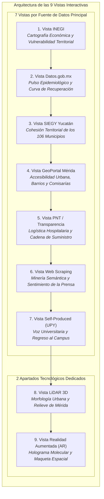

# Data Storytelling: El Viaje de la Resiliencia, la Ciencia y la Comunidad
### *Un viaje interactivo desde el pulso de México hasta la vida en Mérida y la UPY*

---

## 🌟 Descripción General del Proyecto

Este proyecto es una plataforma interactiva de **Data Storytelling y Visualización Avanzada de Datos** centrada en la resiliencia comunitaria, la ciencia y la respuesta territorial ante desafíos socio-sanitarios contemporáneos en Yucatán y la UPY.

A diferencia de reportes estáticos con gráficas convencionales, la plataforma se estructura en **9 Vistas / Pestañas Temáticas de Visualización Interactiva**:
- **7 Vistas guiadas por Fuentes de Datos Principales**, donde cada vista tiene una fuente titular destacada que se enriquece de forma complementaria con las demás fuentes.
- **2 Apartados Tecnológicos Especiales** dedicados a experiencias inmersivas: **LiDAR 3D** y **Realidad Aumentada (AR)**, generados a partir de los datos espaciales, demográficos y biológicos de las fuentes anteriores.

---

## 🧭 Arquitectura de las 9 Vistas de Visualización



---

## 📊 Matriz de Visualizaciones por Vista

| No. | Vista / Pestaña | Fuente Principal (Titular) | Fuentes Complementarias | Experiencia Visual Compleja | Hilo de Storytelling |
| :---: | :--- | :--- | :--- | :--- | :--- |
| **1** | **INEGI** | **INEGI** (DENUE Sector 62 & Censo 2020) | Datos.gob.mx, SIEGY | **Explorador Cartográfico con Clusters Dinámicos y Cobertura** | *La Red que nos Cuida:* Distribución y cercanía de la red de salud pública y privada. |
| **2** | **Datos.gob.mx** | **Datos.gob.mx** (DGE Secretaría de Salud) | INEGI, PNT | **Diagrama de Sankey de Rutas Clínicas + Curvas de Recuperación** | *La Curva de la Esperanza:* Altas médicas, velocidad de atención y superación de olas. |
| **3** | **SIEGY Yucatán** | **SIEGY** (Gobierno del Estado de Yucatán) | Datos.gob.mx, DENUE | **Radar Multidimensional & Mapa de Jurisdicciones Sanitarias** | *El Latido del Mayab:* Cohesión entre los municipios del interior y la zona metropolitana. |
| **4** | **GeoPortal Mérida** | **GeoPortal Ayuntamiento de Mérida** | DENUE, Self-Produced | **Mapa de Isócronas Urbanas y Movilidad a 15 Minutos** | *La Ciudad a Escala Humana:* Accesibilidad a parques, clínicas y puntos de vacunación en barrios y comisarías. |
| **5** | **PNT / Transparencia** | **Plataforma Nacional de Transparencia (PNT)** | Datos.gob.mx, DENUE | **Raincloud Plots & Matriz de Dotación Hospitalaria** | *Héroes de Blanco y Logística de Vida:* Distribución de insumos en hospitales ancla (O'Horán, T1 IMSS). |
| **6** | **Web Scraping** | **Web Scraping Prensa** (Diario de Yucatán, Por Esto!) | Datos.gob.mx | **Red de Co-ocurrencia Semántica (D3 Force) & Sentimiento** | *La Prensa que Informó y Unió:* Crónica interactiva y optimismo en las jornadas de vacunación. |
| **7** | **Self-Produced Data** | **Encuesta Estudiantil y Percepción UPY** | GeoPortal, DGE Salud | **Dashboard Demoscópico con Escalas Likert Dinámicas** | *Voces Universitarias:* Adaptación remota, bienestar emocional y el nuevo día a día en la UPY. |
| **8** | **LiDAR 3D** | *Alimentado por Continuo de Elevación INEGI + LiDAR Mérida* | DENUE, GeoPortal | **Maqueta Altimétrica 3D Interactiva (Deck.gl / Three.js)** | *Mérida en Tres Dimensiones:* Relieve urbano, dosel vegetal y morfología tridimensional. |
| **9** | **Realidad Aumentada (AR)**| *Alimentado por PDB 6VXX + Mallas Urbanas Mérida* | WebXR, Three.js, AR.js | **Holograma Molecular Spike & Maqueta de Mesa en AR** | *La Ciencia en tus Manos:* Proyección holográfica del complejo de la vacuna y maqueta territorial en tu propio espacio. |

---

## 👥 Asignaciones del Equipo para Carga de Datos (`/data`)

Cada visualización cuenta con su propia carpeta dentro de [`data/`](file:///c:/Users/russe/Documents/github_repo/Mexico-DataViz-by-UPY/data) dividida en **Fuente Origen** y al menos **Dos Fuentes Extras** de cruce:

| Integrante | Módulos Asignados | Carpetas de Datos | Tipos de Datos Soportados |
| :--- | :--- | :--- | :--- |
| **Ale** | 1. INEGI DENUE<br>2. Datos.gob.mx<br>3. SIEGY Yucatán | [`data/01_inegi_denue/`](file:///c:/Users/russe/Documents/github_repo/Mexico-DataViz-by-UPY/data/01_inegi_denue)<br>[`data/02_datos_gob/`](file:///c:/Users/russe/Documents/github_repo/Mexico-DataViz-by-UPY/data/02_datos_gob)<br>[`data/03_siegy_yucatan/`](file:///c:/Users/russe/Documents/github_repo/Mexico-DataViz-by-UPY/data/03_siegy_yucatan) | `CSV`, `GeoJSON`, `API REST`, `XLSX` |
| **Russel (Russelsin)** | 4. GeoPortal Mérida<br>6. Web Scraping Prensa<br>7. Self-Produced UPY | [`data/04_geoportal_merida/`](file:///c:/Users/russe/Documents/github_repo/Mexico-DataViz-by-UPY/data/04_geoportal_merida)<br>[`data/06_web_scraping/`](file:///c:/Users/russe/Documents/github_repo/Mexico-DataViz-by-UPY/data/06_web_scraping)<br>[`data/07_self_produced_upy/`](file:///c:/Users/russe/Documents/github_repo/Mexico-DataViz-by-UPY/data/07_self_produced_upy) | `GeoJSON`, `Shapefile`, `JSON`, `CSV` (Scraping & Forms) |
| **Daniel** | 5. Transparencia PNT<br>8. LiDAR 3D<br>9. Realidad Aumentada (AR) | [`data/05_transparencia_pnt/`](file:///c:/Users/russe/Documents/github_repo/Mexico-DataViz-by-UPY/data/05_transparencia_pnt)<br>[`data/08_lidar_3d/`](file:///c:/Users/russe/Documents/github_repo/Mexico-DataViz-by-UPY/data/08_lidar_3d)<br>[`data/09_realidad_aumentada_ar/`](file:///c:/Users/russe/Documents/github_repo/Mexico-DataViz-by-UPY/data/09_realidad_aumentada_ar) | `CSV`, `GeoTIFF`, `DEM/LAS`, `PDB`, `GLTF/GLB`, `JSON` |

---

## 🏗️ Arquitectura Modular del Código

El proyecto sigue una estructura limpia, escalable y desacoplada basada en módulos ES6, hojas de estilo y repositorio estructurado de datos:

```
Mexico-DataViz-by-UPY/
├── data/                               # Repositorio central de datasets crudos y procesados
│   ├── 01_inegi_denue/                 # [Ale] Fuente Origen INEGI + 2 Extras (Datos.gob, SIEGY)
│   ├── 02_datos_gob/                   # [Ale] Fuente Origen DGE + 2 Extras (INEGI Censo, PNT)
│   ├── 03_siegy_yucatan/               # [Ale] Fuente Origen SIEGY + 2 Extras (DGE, DENUE)
│   ├── 04_geoportal_merida/            # [Russel] Fuente Origen GeoPortal + 2 Extras (DENUE, Self-Data)
│   ├── 05_transparencia_pnt/           # [Daniel] Fuente Origen PNT + 2 Extras (IRAG, DENUE)
│   ├── 06_web_scraping/                # [Russel] Fuente Origen Prensa Scraped + 2 Extras (Datos.gob, Gacetas)
│   ├── 07_self_produced_upy/           # [Russel] Fuente Origen Encuesta UPY + 2 Extras (GeoPortal, ENSANUT)
│   ├── 08_lidar_3d/                    # [Daniel] Fuente Origen Continuo CEM + 2 Extras (Malla Urbana, DENUE)
│   ├── 09_realidad_aumentada_ar/       # [Daniel] Fuente Origen PDB 6VXX + 2 Extras (Malla UPY, WebXR)
│   └── README.md                       # Matriz general y guía de formatos de datos
├── index.html                          # Punto de entrada HTML semántico y limpio
├── prototipo_digital.html              # Redirección de compatibilidad a index.html
├── css/
│   ├── style.css                       # Variables de diseño, reset, paleta y layout
│   ├── components.css                  # Header, pestañas, botones, tarjetas KPI, modal <dialog> y toasts
│   └── visualizations.css              # Lienzos de canvas, mapa GIS SVG, visor 3D y superposiciones
├── js/
│   ├── data/
│   │   └── viewsData.js                # Dataset estructurado de las 9 vistas (fuentes, KPIs, datos)
│   ├── modules/
│   │   ├── gisMap.js                   # Renderizador de mapa cartográfico interactivo GIS
│   │   ├── charts.js                   # Controlador Chart.js (líneas, barras, radar multieje)
│   │   ├── forceGraph.js               # Simulación de física de fuerzas para grafo semántico
│   │   ├── threeVisuals.js             # Entorno 3D WebGL (LiDAR y AR molecular con OrbitControls)
│   │   └── storytelling.js             # Narración por voz (Web Speech API), Auto-Tour y notificaciones
│   └── app.js                          # Coordinador central de la aplicación y eventos del DOM
├── FUENTES_Y_PLAN_DE_ANALISIS.md       # Metodología exhaustiva y fuentes de datos
└── PROTOTIPO_BORRADOR_WIREFRAMES.md    # Wireframes y borradores de diseño
```

---

## 🎨 Principios de Diseño e Interacción
- **View Transitions API:** Transiciones fluidas nativas entre vistas temáticas.
- **Narración Auditiva:** Soporte para lectura en voz alta con Web Speech API.
- **Interacción 3D Completa:** OrbitControls para rotar, acercar y panear las maquetas volumétricas.
- **Storytelling Progresivo:** Hilo conductor humano y optimista desde la perspectiva macro (México y Sur) hasta el nivel micro (Mérida, colonias, la UPY y la escala molecular).
- **Estética de Vanguardia:** Paleta con gradientes, soporte glassmorphism y micro-interacciones responsivas.

